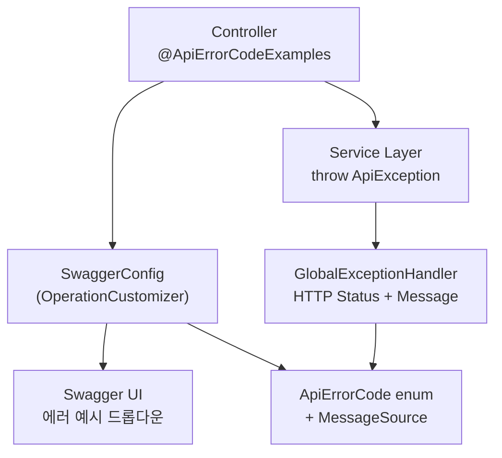

프론트엔드와 백엔드 간 API 소통 문서로 Swagger UI가 자주 사용됩니다.
API를 개발하다 보면 에러 응답 코드를 정의해야 할 때가 오는데, `@ApiResponse` 어노테이션을 일일이 작성하다 보면 비즈니스 코드가 점점 비대해지고, 비즈니스 로직과 Swagger 문서화 로직이 혼재되기 시작합니다.

이번 글에서는 **커스텀 어노테이션과 에러코드 enum**을 활용하여, 비즈니스 코드와 문서화 로직을 분리하면서 Swagger UI에 에러 응답 예시를 **자동으로 생성**하는 패턴을 소개합니다.

## 도입 배경

에러 응답 문서화를 자동화하기 전에는 다음과 같은 문제가 있었습니다:

- **반복적인 수동 작성**: 모든 API 메서드에 `@ApiResponse` 어노테이션을 하나씩 작성해야 했습니다. 에러 종류가 추가될 때마다 관련된 모든 컨트롤러를 수정해야 했습니다.
- **문서와 실제 동작의 불일치**: Swagger 문서에는 400 에러만 기술했는데 실제로는 404도 발생하는 등, 문서와 실제 에러 응답이 달라지는 문제가 빈번했습니다.
- **HTTP Status 관리의 분산**: 에러별 HTTP Status 코드가 코드 곳곳에 하드코딩되어 있어 일관성을 유지하기 어려웠습니다.

이 문제들을 해결하기 위해 다음 목표를 세웠습니다:

| 항목 | Before | After |
|------|--------|-------|
| Swagger 에러 문서 | `@ApiResponse` 수동 작성 | 어노테이션 하나로 자동 생성 |
| HTTP Status 관리 | 코드마다 분산 | enum으로 중앙 집중화 |
| 에러 메시지 | 하드코딩 | MessageSource로 국제화 지원 |

---

## 아키텍처

### 전체 흐름

<div style="max-width: 700px; margin: 0 auto;">



</div>

**처리 흐름**:

1. Controller 메서드에 `@ApiErrorCodeExamples` 어노테이션을 적용하여 발생 가능한 에러코드를 선언
2. `OperationCustomizer`가 어노테이션을 읽어 Swagger UI에 에러 예시를 자동 생성
3. Service에서 `ApiException`을 throw하면 `GlobalExceptionHandler`가 enum에 매핑된 HTTP Status와 메시지를 반환

### 핵심 컴포넌트

| 컴포넌트 | 역할 |
|----------|------|
| `ApiErrorCode` | 에러코드와 HTTP Status를 매핑하는 enum |
| `ApiException` | 에러코드 기반 커스텀 예외 클래스 |
| `ApiErrorCodeExamples` | Controller에 적용하는 Swagger 어노테이션 |
| `GlobalExceptionHandler` | 예외를 HTTP 응답으로 변환하는 핸들러 |
| `SwaggerConfig` | OperationCustomizer로 Swagger 문서 자동 생성 |

### 파일 구조

```
src/main/java/com/example/
├── common/
│   ├── ApiErrorCode.java           # 에러코드 enum
│   └── ErrorResponse.java          # 에러 응답 DTO
├── exception/
│   ├── ApiException.java           # 커스텀 예외 클래스
│   ├── ApiErrorCodeExamples.java   # Swagger 어노테이션
│   └── GlobalExceptionHandler.java # 예외 핸들러
└── config/
    └── SwaggerConfig.java          # OperationCustomizer 설정
```

---

## 구현 가이드

### Step 1: ApiErrorCode (에러코드 enum)

모든 에러의 코드, HTTP Status, 메시지를 한곳에서 관리하는 enum입니다.

```java
@Getter
@RequiredArgsConstructor
public enum ApiErrorCode {

    // 400 Bad Request
    BAD_REQUEST("E400", HttpStatus.BAD_REQUEST),
    INVALID_PARAMETER("E400.01", HttpStatus.BAD_REQUEST),

    // 401 Unauthorized
    UNAUTHORIZED("E401", HttpStatus.UNAUTHORIZED),

    // 404 Not Found
    NOT_FOUND("E404", HttpStatus.NOT_FOUND),

    // 409 Conflict
    CONFLICT("E409", HttpStatus.CONFLICT),
    ALREADY_EXISTS("E409.01", HttpStatus.CONFLICT),

    // 500 Internal Server Error
    INTERNAL_SERVER_ERROR("E500", HttpStatus.INTERNAL_SERVER_ERROR),
    EXTERNAL_API_ERROR("E500.01", HttpStatus.INTERNAL_SERVER_ERROR);

    private final String code;
    private final HttpStatus status;
}
```

`E400`, `E400.01` 형태로 대분류와 세부 에러를 구분합니다. HTTP Status를 enum에 직접 매핑하여, 에러 코드만 알면 어떤 HTTP Status로 응답해야 하는지 자동으로 결정됩니다.

### Step 2: ApiException (커스텀 예외)

```java
@Getter
public class ApiException extends RuntimeException {
    private final ApiErrorCode errorCode;

    public ApiException(ApiErrorCode errorCode) {
        super(errorCode.getCode());
        this.errorCode = errorCode;
    }

    public ApiException(ApiErrorCode errorCode, Throwable cause) {
        super(errorCode.getCode(), cause);
        this.errorCode = errorCode;
    }
}
```

에러코드 enum만 전달하면 예외가 생성됩니다. 메시지는 `GlobalExceptionHandler`에서 MessageSource를 통해 조회하므로, 예외 클래스 자체는 단순하게 유지됩니다.

### Step 3: ApiErrorCodeExamples (Swagger 어노테이션)

```java
@Target(ElementType.METHOD)
@Retention(RetentionPolicy.RUNTIME)
public @interface ApiErrorCodeExamples {
    ApiErrorCode[] value();
}
```

Controller 메서드에 적용하여 해당 API에서 발생할 수 있는 에러코드를 선언합니다. 런타임에 `OperationCustomizer`가 이 어노테이션을 읽어 Swagger 문서를 자동 생성합니다.

### Step 4: ErrorResponse (에러 응답 DTO)

Swagger 문서와 실제 응답에서 공통으로 사용할 에러 응답 형식을 정의합니다.

```java
@Getter
@AllArgsConstructor
public class ErrorResponse {
    private final String code;
    private final String message;
}
```

### Step 5: GlobalExceptionHandler (예외 핸들러)

```java
@Slf4j
@RestControllerAdvice
@Order(Ordered.HIGHEST_PRECEDENCE)
@RequiredArgsConstructor
public class GlobalExceptionHandler {

    private final MessageSourceAccessor messageSourceAccessor;

    @ExceptionHandler(ApiException.class)
    public ResponseEntity<ErrorResponse> handleApiException(ApiException ex) {
        ApiErrorCode errorCode = ex.getErrorCode();
        String message = messageSourceAccessor.getMessage(
            errorCode.getCode(), "에러가 발생했습니다");

        log.error("ApiException: code={}, status={}, message={}",
                errorCode.getCode(), errorCode.getStatus(), message, ex);

        ErrorResponse response = new ErrorResponse(errorCode.getCode(), message);
        return ResponseEntity.status(errorCode.getStatus()).body(response);
    }
}
```

핵심 포인트:
- `@Order(HIGHEST_PRECEDENCE)`로 다른 예외 핸들러보다 우선 처리되어, 기존 예외 처리 로직과 독립적으로 동작합니다.
- MessageSource에서 에러코드로 메시지를 조회하므로 국제화(i18n)를 지원합니다.

### Step 6: SwaggerConfig (OperationCustomizer)

이 클래스가 자동 문서화의 핵심입니다. Controller의 `@ApiErrorCodeExamples` 어노테이션을 읽어 Swagger UI에 에러 응답 예시를 자동으로 추가합니다.

```java
@Configuration
@RequiredArgsConstructor
public class SwaggerConfig {

    private final MessageSourceAccessor messageSourceAccessor;

    @Bean
    public OperationCustomizer operationCustomizer() {
        return (Operation operation, HandlerMethod handlerMethod) -> {
            ApiErrorCodeExamples annotation =
                handlerMethod.getMethodAnnotation(ApiErrorCodeExamples.class);
            if (annotation != null) {
                generateErrorExamples(operation, annotation.value());
            }
            return operation;
        };
    }

    private void generateErrorExamples(Operation operation, ApiErrorCode[] errorCodes) {
        Map<Integer, List<ApiErrorCode>> groupedByStatus = Arrays.stream(errorCodes)
                .collect(Collectors.groupingBy(code -> code.getStatus().value()));

        groupedByStatus.forEach((status, codes) -> {
            MediaType mediaType = new MediaType();
            codes.forEach(code -> mediaType.addExamples(
                code.getCode(), createExample(code)));

            operation.getResponses().addApiResponse(
                String.valueOf(status),
                new ApiResponse()
                    .description("에러 응답")
                    .content(new Content()
                        .addMediaType("application/json", mediaType))
            );
        });
    }

    private Example createExample(ApiErrorCode errorCode) {
        String message = messageSourceAccessor.getMessage(
            errorCode.getCode(), "에러가 발생했습니다");
        Example example = new Example();
        example.setValue(Map.of(
            "code", errorCode.getCode(),
            "message", message
        ));
        example.setDescription(message);
        return example;
    }
}
```

동작 원리:
1. `OperationCustomizer`가 모든 API Operation을 순회하며 `@ApiErrorCodeExamples` 어노테이션을 확인
2. 어노테이션에 선언된 에러코드들을 **HTTP Status별로 그룹핑**
3. 각 에러코드별로 Example 객체를 생성하여 Swagger 응답에 추가
4. Swagger UI에서는 동일 HTTP Status 내 에러코드를 **드롭다운으로 선택**하여 확인 가능

### Step 7: 메시지 설정

**message.properties**:

```properties
# 400 Bad Request
E400=잘못된 요청입니다.
E400.01=유효하지 않은 파라미터입니다.

# 401 Unauthorized
E401=인증이 필요합니다.

# 404 Not Found
E404=요청한 리소스를 찾을 수 없습니다.

# 409 Conflict
E409=요청이 충돌했습니다.
E409.01=이미 존재하는 데이터입니다.

# 500 Internal Server Error
E500=서버 에러가 발생했습니다.
E500.01=외부 API 호출 중 에러가 발생했습니다.
```

에러코드를 key로 사용하므로, enum에 새 에러코드를 추가할 때 여기에도 메시지를 정의하면 Swagger 문서와 실제 응답 모두에 반영됩니다.

---

## 사용법

### Controller에 어노테이션 적용

```java
@RestController
@RequestMapping("/api/users")
@RequiredArgsConstructor
public class UserController {

    private final UserService userService;

    @ApiErrorCodeExamples({
        ApiErrorCode.BAD_REQUEST,
        ApiErrorCode.NOT_FOUND,
        ApiErrorCode.UNAUTHORIZED
    })
    @GetMapping("/{id}")
    public ResponseEntity<UserDto> getUser(@PathVariable Long id) {
        return ResponseEntity.ok(userService.getUser(id));
    }
}
```

이것이 전부입니다. `@ApiErrorCodeExamples`에 에러코드를 나열하면 Swagger UI에 해당 에러 응답이 자동으로 표시됩니다.

어노테이션 적용 후 Swagger UI에서는 HTTP Status별로 에러 예시가 드롭다운으로 표시됩니다:


### Service에서 예외 발생

```java
@Service
public class UserService {

    public UserDto getUser(Long id) {
        return userRepository.findById(id)
            .orElseThrow(() -> new ApiException(ApiErrorCode.NOT_FOUND));
    }
}
```

### 예외 체이닝 (원인 예외 포함)

외부 API 호출 등에서 원인 예외를 함께 전달하고 싶을 때:

```java
try {
    externalApiCall();
} catch (Exception e) {
    throw new ApiException(ApiErrorCode.EXTERNAL_API_ERROR, e);
}
```

---

## 에러코드 추가 방법

새로운 에러 코드를 추가하는 절차는 3단계로 간단합니다.

### 1. ApiErrorCode enum에 추가

```java
public enum ApiErrorCode {
    // 기존 코드...
    NEW_ERROR("E400.99", HttpStatus.BAD_REQUEST);
}
```

### 2. 메시지 정의

```properties
E400.99=새로운 에러 메시지입니다.
```

### 3. Controller에 적용

```java
@ApiErrorCodeExamples({ApiErrorCode.NEW_ERROR})
@GetMapping("/example")
public ResponseEntity<Void> example() { ... }
```

enum에 추가하고, 메시지를 정의하고, 어노테이션에 선언하면 끝입니다. Swagger 문서와 실제 에러 응답 모두 자동으로 반영됩니다.

---

## 기존 예외 핸들러와의 공존

이미 예외 처리 로직이 있는 프로젝트에서도 안전하게 도입할 수 있습니다:

- `@Order(HIGHEST_PRECEDENCE)` 설정으로 `ApiException`만 우선 처리
- 기존 예외 처리 로직에 영향 없이 두 시스템이 독립적으로 동작
- 기존 비즈니스 예외는 그대로 유지하면서 새로운 API에만 점진적으로 적용 가능

---

## 주의사항

1. **에러코드 중복 방지**: 새로운 에러코드 추가 시 기존 코드와 중복되지 않는지 확인
2. **메시지 동기화**: `ApiErrorCode` enum 추가 시 반드시 `message.properties`에 메시지 정의
3. **HTTP Status 일관성**: 동일한 성격의 에러는 동일한 HTTP Status 사용

---

## 결론

이 패턴을 적용하면 다음과 같은 효과를 얻을 수 있습니다:

- **반복 작업 제거**: `@ApiResponse`를 일일이 작성하지 않아도 됩니다
- **에러 처리 중앙화**: 에러코드, HTTP Status, 메시지가 모두 한곳에서 관리됩니다
- **문서 정합성**: Swagger 문서와 실제 에러 응답이 항상 동일하게 유지됩니다
- **타입 안전성**: enum 기반이므로 존재하지 않는 에러코드를 참조할 수 없습니다

어노테이션 하나로 Swagger 문서와 에러 응답을 동시에 관리할 수 있으므로, API가 많아질수록 효과가 커집니다. 에러 응답 문서화에 반복적인 노력을 들이고 있다면 도입을 검토해 보시기 바랍니다.

---

## 참고 자료

- [Springdoc-OpenAPI 공식 문서](https://springdoc.org/)
- [Spring Boot Exception Handling Best Practices](https://spring.io/blog/2013/11/01/exception-handling-in-spring-mvc)
- [OpenAPI 3.0 Specification](https://swagger.io/specification/)
- [Swagger UI에 에러 응답 예시 적용하기](https://devnm.tistory.com/29)
