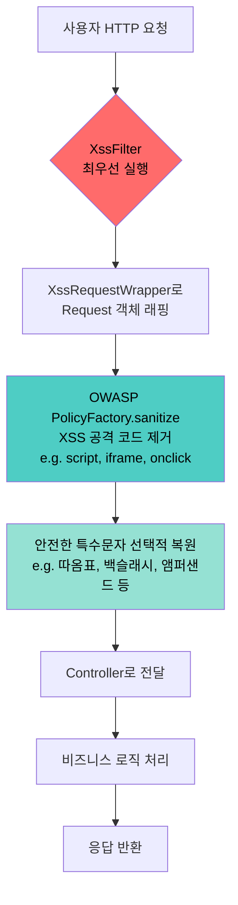
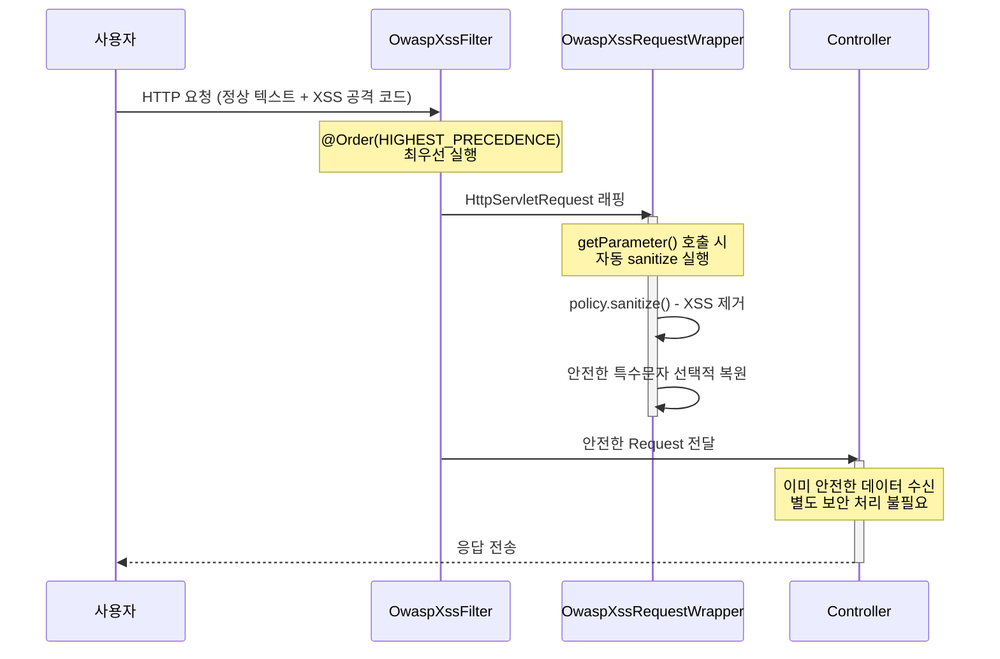

웹 애플리케이션 보안에서 XSS(Cross-Site Scripting)는 빈번하게 발생하는 보안 취약점 중 하나입니다.  
이번 글에서는 **OWASP Java HTML Sanitizer**를 활용하여 Spring Boot 웹 애플리케이션에서 XSS 공격을 자동으로 방어하는 Servlet Filter 구현 방법을 소개합니다.

## XSS란?

XSS(Cross-Site Scripting)는 공격자가 웹 페이지에 악의적인 스크립트를 주입하여 사용자 정보 탈취, 세션 하이재킹, 피싱 등을 수행하는 웹 보안 취약점입니다.

### 공격 코드 예시

**1. 기본 스크립트 삽입**

```html
<script>alert('XSS')</script>
```

게시판 등의 입력 필드에 스크립트 태그를 직접 삽입하는 가장 기본적인 공격입니다.

**2. 이벤트 핸들러 악용**

```html

```

존재하지 않는 이미지를 로드하여 `onerror` 이벤트를 트리거하고, 사용자의 쿠키를 공격자 서버로 전송합니다.

**3. iframe을 이용한 피싱**

```html
<iframe srcdoc="<svg/onload=alert('XSS')>"></iframe>
```

iframe 내부에 SVG 태그와 `onload` 이벤트를 조합하여 스크립트를 실행합니다.

**4. javascript: 프로토콜**

```html
<a href="javascript:alert(document.cookie)">이벤트 당첨! 클릭하세요</a>
```

링크 클릭 시 JavaScript가 실행되어 쿠키 정보가 노출됩니다.

## OWASP Java HTML Sanitizer

Google 보안팀에서 개발 및 관리되고 있는 오픈소스 HTML sanitization 라이브러리입니다.  
XSS 공격으로부터 웹 애플리케이션을 보호하면서 타사에서 작성한 HTML을 포함할 수 있도록 해줍니다. ([OWASP Java HTML Sanitizer](https://owasp.org/www-project-java-html-sanitizer/))  

- **프로그래밍 방식의 POSITIVE 정책 설정**: XML 설정 없이 코드로 허용할 태그/속성만 명시적으로 지정, 나머지는 모두 제거
- **검증된 보안**: 보안 모범 사례에 따라 작성되었으며, AntiSamy의 95% 이상의 테스트 케이스를 통과하고 적대적 보안 리뷰(adversarial security review)를 거친 라이브러리

## 왜 OWASP Java HTML Sanitizer 인가?

XSS 방어에는 크게 **블랙리스트 방식**과 **화이트리스트 방식**이 있습니다.

| 방식 | 동작 원리 | 한계 |
|------|----------|------|
| **블랙리스트** | 알려진 위험 패턴(`<script>`, `onclick` 등)을 탐지하여 차단 | 새로운 공격 벡터나 우회 패턴에 취약 |
| **화이트리스트** | 허용할 태그/속성만 명시하고, **나머지는 모두 공격 코드로 간주하여 제거** | 허용 목록 관리 필요 |

블랙리스트 방식은 일종의 **두더지 잡기 게임**과 같습니다.   
`<script>`를 막으면 ``가 튀어나오고, 이를 막으면 `<svg onload>`가, 다시 막으면 `<iframe srcdoc>`가 나타납니다.   
새로운 우회 기법이 발견될 때마다 규칙을 추가해야 하는 끝없는 추격전이 됩니다.


반면 화이트리스트 방식은 허용된 코드 외의 모든 HTML 태그를 일괄적으로 공격 코드로 판단하여 Filter 레이어에서 삭제 처리하므로, 알려지지 않은 공격 벡터까지 원천 차단할 수 있습니다.

OWASP Java HTML Sanitizer는 이 **화이트리스트 방식**을 채택한 대표적인 라이브러리로, Servlet Filter 레이어에서 안전한 태그만 통과시키고 나머지는 모두 제거하는 구조를 간편하게 구현할 수 있습니다.

## 아키텍처

### 전체 동작 흐름

<div style="max-width: 700px; margin: 0 auto;">



</div>

### 요청 처리 시퀀스

<div style="max-width: 700px; margin: 0 auto;">



</div>

### 핵심 컴포넌트

| 컴포넌트 | 역할 |
|----------|------|
| **OwaspXssFilter** | Servlet Filter로서 모든 HTTP 요청을 가로채어 Request 객체를 래핑 |
| **OwaspXssRequestWrapper** | HttpServletRequestWrapper를 상속하여 파라미터 접근 시 자동 sanitize 적용 |

> **주의**: `PolicyFactory.sanitize()`를 호출하면 XSS로 의심되는 코드가 삭제되지만, 동시에 입력된 모든 특수문자가 HTML 코드로 인코딩되는 동작이 불가피합니다. (예: `"` → `&#34;`, `&` → `&amp;`)
> 따라서 입력 데이터의 정합성을 위해 **안전한 특수문자는 원본 데이터로 복원하는 후처리**가 반드시 필요합니다. 자세한 내용은 [특수문자 선택적 복원](#특수문자-선택적-복원) 섹션을 참고하세요.

## 구현 가이드

### 의존성 추가

**Gradle:**

```groovy
implementation 'com.googlecode.owasp-java-html-sanitizer:owasp-java-html-sanitizer:20240325.1'
```

**Maven:**

```xml
<dependency>
    <groupId>com.googlecode.owasp-java-html-sanitizer</groupId>
    <artifactId>owasp-java-html-sanitizer</artifactId>
    <version>20240325.1</version>
</dependency>
```

### Step 1: XSS Filter 구현

모든 HTTP 요청을 가로채어 XSS 방어를 자동 적용하는 Servlet Filter를 구현합니다.  
허용 정책은 별도의 XML 설정 파일 없이 Java 코드로 직접 커스터마이징할 수 있습니다.

```java
import jakarta.servlet.*;
import jakarta.servlet.http.HttpServletRequest;
import org.owasp.html.HtmlPolicyBuilder;
import org.owasp.html.PolicyFactory;
import org.springframework.core.Ordered;
import org.springframework.core.annotation.Order;
import org.springframework.stereotype.Component;

import java.io.IOException;

@Component
@Order(Ordered.HIGHEST_PRECEDENCE)
public class OwaspXssFilter implements Filter {

    private final PolicyFactory policy;

    public OwaspXssFilter() {
        this.policy = new HtmlPolicyBuilder()
            // 블록 요소
            .allowElements(
                "p", "div", "br",
                "h1", "h2", "h3", "h4", "h5", "h6",
                "blockquote", "pre"
            )
            // 인라인 요소
            .allowElements(
                "span", "strong", "em", "u", "s", "code"
            )
            // 리스트
            .allowElements("ul", "ol", "li")
            // 링크
            .allowElements("a")
            .allowUrlProtocols("https", "http")
            .allowAttributes("href").onElements("a")
            .requireRelNofollowOnLinks()
            // 이미지
            .allowElements("img")
            .allowAttributes("src", "alt", "title").onElements("img")
            // 테이블
            .allowElements(
                "table", "thead", "tbody", "tfoot",
                "tr", "th", "td", "caption"
            )
            // 글로벌 속성
            .allowAttributes("class").globally()
            .allowAttributes("id").globally()
            .toFactory();
    }

    @Override
    public void doFilter(ServletRequest request, ServletResponse response,
                         FilterChain chain) throws IOException, ServletException {
        HttpServletRequest httpRequest = (HttpServletRequest) request;
        OwaspXssRequestWrapper wrappedRequest =
            new OwaspXssRequestWrapper(httpRequest, policy);
        chain.doFilter(wrappedRequest, response);
    }
}
```

**핵심 설계 포인트:**

| 포인트 | 설명 |
|--------|------|
| `@Order(HIGHEST_PRECEDENCE)` | 다른 모든 Filter보다 먼저 실행되어 XSS 방어의 최전선 역할 |
| `PolicyFactory` 생성자 초기화 | 스레드 안전하며, 한 번 생성 후 재사용 |
| `HtmlPolicyBuilder` | 화이트리스트 정책을 빌더 패턴으로 구성 |

### Step 2: Request Wrapper 구현

파라미터 접근 시 자동으로 sanitize를 적용하는 HttpServletRequestWrapper를 구현합니다.

```java
import jakarta.servlet.http.HttpServletRequest;
import jakarta.servlet.http.HttpServletRequestWrapper;
import org.owasp.html.PolicyFactory;

import java.util.*;

public class OwaspXssRequestWrapper extends HttpServletRequestWrapper {

    private final PolicyFactory policy;

    public OwaspXssRequestWrapper(HttpServletRequest request,
                                  PolicyFactory policy) {
        super(request);
        this.policy = policy;
    }

    @Override
    public String getParameter(String name) {
        String value = super.getParameter(name);
        return sanitize(value);
    }

    @Override
    public String[] getParameterValues(String name) {
        String[] values = super.getParameterValues(name);
        if (values == null) {
            return null;
        }

        String[] sanitizedValues = new String[values.length];
        for (int i = 0; i < values.length; i++) {
            sanitizedValues[i] = sanitize(values[i]);
        }
        return sanitizedValues;
    }

    @Override
    public Map<String, String[]> getParameterMap() {
        Map<String, String[]> originalMap = super.getParameterMap();
        Map<String, String[]> sanitizedMap = new HashMap<>();

        for (Map.Entry<String, String[]> entry : originalMap.entrySet()) {
            String[] values = entry.getValue();
            String[] sanitizedValues = new String[values.length];
            for (int i = 0; i < values.length; i++) {
                sanitizedValues[i] = sanitize(values[i]);
            }
            sanitizedMap.put(entry.getKey(), sanitizedValues);
        }

        return Collections.unmodifiableMap(sanitizedMap);
    }

    private String sanitize(String value) {
        if (value == null) {
            return null;
        }

        // 1단계: OWASP로 XSS 방어
        String sanitized = policy.sanitize(value);

        // 2단계: 안전한 문자만 선택적 복원
        sanitized = sanitized.replace("&#34;", "\"");
        sanitized = sanitized.replace("&quot;", "\"");
        sanitized = sanitized.replace("&#39;", "'");
        sanitized = sanitized.replace("&apos;", "'");
        sanitized = sanitized.replace("&#x27;", "'");
        sanitized = sanitized.replace("&#92;", "\\");
        sanitized = sanitized.replace("&#x5c;", "\\");
        sanitized = sanitized.replace("&#x5C;", "\\");
        sanitized = sanitized.replace("&#64;", "@");
        sanitized = sanitized.replace("&#x40;", "@");
        sanitized = sanitized.replace("&#43;", "+");
        sanitized = sanitized.replace("&#x2b;", "+");
        sanitized = sanitized.replace("&#x2B;", "+");
        sanitized = sanitized.replace("&#61;", "=");
        sanitized = sanitized.replace("&#x3d;", "=");
        sanitized = sanitized.replace("&#x3D;", "=");

        // &amp; 복원은 반드시 마지막에 수행
        sanitized = sanitized.replace("&amp;", "&");

        return sanitized;
    }
}
```

## 화이트리스트 정책 상세

### 허용 태그 (25개)

| 카테고리 | 태그 | 용도 |
|----------|------|------|
| 블록 요소 | `p`, `div`, `br`, `h1`~`h6`, `blockquote`, `pre` | 문단, 제목, 인용, 코드 블록 |
| 텍스트 강조 | `strong`, `em`, `u`, `s`, `code` | 굵게, 기울임, 밑줄, 취소선, 인라인 코드 |
| 리스트 | `ul`, `ol`, `li` | 순서/비순서 목록 |
| 링크 | `a` (href만 허용, nofollow 강제) | 하이퍼링크 |
| 이미지 | `img` (src, alt, title만 허용) | 이미지 삽입 |
| 테이블 | `table`, `thead`, `tbody`, `tfoot`, `tr`, `th`, `td`, `caption` | 데이터 테이블 |

### 차단 대상 (허용 정책 외 모든 대상)

| 카테고리 | 차단 대상 | 이유 |
|----------|----------|------|
| 스크립트 | `<script>` | JavaScript 실행 → XSS 핵심 벡터 |
| 프레임 | `<iframe>`, `<object>`, `<embed>` | 외부 콘텐츠 삽입 → 악성 페이지 로드 |
| 폼 요소 | `<form>`, `<input>`, `<button>` | 사용자 입력 탈취 → 피싱 |
| 이벤트 핸들러 | `onclick`, `onerror`, `onload` 등 | JavaScript 실행 트리거 |
| 위험 프로토콜 | `javascript:`, `data:`, `vbscript:` | URL을 통한 스크립트 실행 |
| 스타일 | `style` 속성, `<style>` 태그 | CSS Injection |

## 특수문자 선택적 복원 정책

### 문제

OWASP Sanitizer는 sanitize 과정에서 모든 특수문자를 [HTML 코드](https://www.ascii-code.com/)로 인코딩합니다. 이로 인해 Controller 단에서 JSON 데이터를 Java 객체로 역직렬화할 때 파싱 오류가 발생할 수 있습니다.

```
입력 데이터: ["option1","option2"]
1단계 sanitize: [&#34;option1&#34;,&#34;option2&#34;]   ← JSON 역직렬화 불가
```

### 복원 대상 및 차단 유지 대상

**복원하는 문자 (안전):**

| Entity | 복원 결과 | 용도 |
|--------|----------|------|
| `&#34;`, `&quot;` | `"` | 큰따옴표 |
| `&#39;`, `&apos;` | `'` | 작은따옴표 |
| `&#92;` | `\` | JSON 이스케이프 |
| `&#64;` | `@` | 이메일 주소 |
| `&#43;` | `+` | 검색어, 연산자 |
| `&#61;` | `=` | 파라미터 값 구분 |
| `&amp;` | `&` | 앰퍼샌드 (**반드시 마지막에 복원**) |

**차단 유지하는 문자 (위험):**

| Entity | 문자 | 이유 |
|--------|------|------|
| `&lt;` | `<` | HTML 태그 시작 → XSS 핵심 벡터 |
| `&gt;` | `>` | HTML 태그 종료 → XSS 핵심 벡터 |

> **주의**: `&amp;` 복원은 반드시 마지막에 수행해야 합니다. `&amp;`를 먼저 복원하면 `&amp;quot;` → `&quot;` → `"`로 이중 디코딩(double-decoding)되어 사용자의 원본 데이터가 변조됩니다.

### 복원 예시

```
입력: ["4","5"]
1단계 Sanitize: [&#34;4&#34;,&#34;5&#34;]    (XSS 제거 + 인코딩)
2단계 선택적 복원: ["4","5"]               (따옴표 복원 → JSON 역직렬화 가능)

입력: <script>alert(1)</script>
1단계 Sanitize: (빈 문자열)                (위험 태그 완전 제거)
2단계 선택적 복원: (빈 문자열)              (XSS 차단 유지)

입력: 안녕하세요.<iframe srcdoc="<svg/onload=alert(4)>"></iframe>감사합니다.
1단계 Sanitize: 안녕하세요.감사합니다.       (위험 태그만 제거, 텍스트 보존)
2단계 선택적 복원: 안녕하세요.감사합니다.     (변환 대상 없음)
```

## 테스트

```java
import org.junit.jupiter.api.*;
import org.owasp.html.HtmlPolicyBuilder;
import org.owasp.html.PolicyFactory;

@TestMethodOrder(MethodOrderer.OrderAnnotation.class)
public class OwaspPolicyTest {

    private PolicyFactory policy;

    @BeforeEach
    public void setUp() {
        this.policy = new HtmlPolicyBuilder()
            .allowElements("p", "div", "br", "h1", "h2", "h3", "h4", "h5", "h6",
                           "blockquote", "pre", "span", "strong", "em", "u", "s",
                           "code", "ul", "ol", "li", "a", "img",
                           "table", "thead", "tbody", "tfoot", "tr", "th", "td", "caption")
            .allowUrlProtocols("https", "http")
            .allowAttributes("href").onElements("a")
            .requireRelNofollowOnLinks()
            .allowAttributes("src", "alt", "title").onElements("img")
            .allowAttributes("class").globally()
            .allowAttributes("id").globally()
            .toFactory();
    }

    @Test
    @Order(1)
    @DisplayName("JSON 문자열: sanitize 후 선택적 복원으로 원본 보존")
    public void testJsonString() {
        String input = "[\"1\",\"2\",\"3\"]";
        String sanitized = policy.sanitize(input);
        String restored = sanitized.replace("&#34;", "\"")
                                   .replace("&quot;", "\"");

        Assertions.assertEquals(input, restored);
    }

    @Test
    @Order(2)
    @DisplayName("XSS script 태그: 완전 제거")
    public void testXssScriptTag() {
        String input = "<script>alert('XSS')</script>";
        String sanitized = policy.sanitize(input);

        Assertions.assertTrue(sanitized.isEmpty());
    }

    @Test
    @Order(3)
    @DisplayName("안전한 HTML 태그: 보존")
    public void testSafeHtmlPreserved() {
        String input = "<h2>제목</h2><p><strong>중요</strong> 내용입니다</p>";
        String sanitized = policy.sanitize(input);

        Assertions.assertTrue(sanitized.contains("<h2>"));
        Assertions.assertTrue(sanitized.contains("<strong>"));
        Assertions.assertTrue(sanitized.contains("<p>"));
    }

    @Test
    @Order(4)
    @DisplayName("iframe XSS 공격: 위험 태그만 제거, 텍스트 보존")
    public void testIframeXssRemoved() {
        String input = "안녕하세요.<iframe srcdoc=\"<svg/onload=alert(4)>\"></iframe>감사합니다.";
        String sanitized = policy.sanitize(input);

        Assertions.assertFalse(sanitized.contains("iframe"));
        Assertions.assertFalse(sanitized.contains("onload"));
        Assertions.assertTrue(sanitized.contains("안녕하세요."));
        Assertions.assertTrue(sanitized.contains("감사합니다."));
    }

    @Test
    @Order(5)
    @DisplayName("이벤트 핸들러 공격: onclick 제거")
    public void testEventHandlerRemoved() {
        String input = "<div onclick=\"alert('xss')\">클릭</div>";
        String sanitized = policy.sanitize(input);

        Assertions.assertFalse(sanitized.contains("onclick"));
        Assertions.assertTrue(sanitized.contains("클릭"));
    }

    @Test
    @Order(6)
    @DisplayName("javascript: 프로토콜 공격: 링크 제거")
    public void testJavascriptProtocolRemoved() {
        String input = "<a href=\"javascript:alert('xss')\">링크</a>";
        String sanitized = policy.sanitize(input);

        Assertions.assertFalse(sanitized.contains("javascript"));
    }
}
```

---

## JSON Body(@RequestBody) XSS 방어

### Servlet Parameter와 JSON Body의 차이

위에서 구현한 Filter는 Servlet Parameter(`getParameter()`)만 보호합니다. `application/json` Content-Type의 요청 본문은 Servlet 스펙상 파라미터로 파싱되지 않고, `getInputStream()`을 통해 Jackson이 직접 역직렬화하므로 sanitize 대상이 아닙니다.

```
[Form 전송]  Content-Type: application/x-www-form-urlencoded
  name=홍길동&age=30
  → getParameter("name") = "홍길동"     ← Wrapper sanitize 적용됨

[JSON 전송]  Content-Type: application/json
  {"name":"홍길동","age":30}
  → getParameter("name") = null          ← 파라미터에 없음
  → getInputStream()으로 Jackson 역직렬화  ← Wrapper 오버라이드 대상 아님
```

### 대응 방법: RequestBodyAdvice

Spring의 `RequestBodyAdvice`를 사용하면 기존 Controller 코드 수정 없이 `@RequestBody` 역직렬화 후 자동 sanitize를 적용할 수 있습니다.

```java
@RestControllerAdvice
public class XssRequestBodyAdvice implements RequestBodyAdvice {

    private final PolicyFactory policy;

    public XssRequestBodyAdvice(OwaspXssFilter xssFilter) {
        this.policy = xssFilter.getPolicy();
    }

    @Override
    public boolean supports(MethodParameter parameter, Type targetType,
                            Class<? extends HttpMessageConverter<?>> converterType) {
        return true;
    }

    @Override
    public HttpInputMessage beforeBodyRead(HttpInputMessage inputMessage,
            MethodParameter parameter, Type targetType,
            Class<? extends HttpMessageConverter<?>> converterType) {
        return inputMessage;
    }

    @Override
    public Object afterBodyRead(Object body, HttpInputMessage inputMessage,
            MethodParameter parameter, Type targetType,
            Class<? extends HttpMessageConverter<?>> converterType) {
        sanitizeStringFields(body);
        return body;
    }

    @Override
    public Object handleEmptyBody(Object body, HttpInputMessage inputMessage,
            MethodParameter parameter, Type targetType,
            Class<? extends HttpMessageConverter<?>> converterType) {
        return body;
    }

    private void sanitizeStringFields(Object obj) {
        if (obj == null) return;
        for (Field field : obj.getClass().getDeclaredFields()) {
            if (field.getType() == String.class) {
                field.setAccessible(true);
                try {
                    String value = (String) field.get(obj);
                    if (value != null) {
                        field.set(obj, policy.sanitize(value));
                    }
                } catch (IllegalAccessException e) {
                    // skip
                }
            }
        }
    }
}
```

> **참고**: 리플렉션 기반이므로 중첩 객체, List, Map 필드는 추가 재귀 처리가 필요합니다.

## 추가 보안 권장사항

XSS Filter만으로 완벽한 방어가 되지는 않습니다. **심층 방어(Defense in Depth)** 원칙에 따라 다음 조치를 함께 적용하는 것을 권장합니다.

### 1. Content-Security-Policy 헤더

브라우저에게 "이 페이지에서 실행할 수 있는 리소스의 출처"를 제한하는 HTTP 응답 헤더입니다. XSS로 주입된 인라인 스크립트나 외부 도메인 스크립트가 브라우저 레벨에서 차단되므로, Sanitizer가 놓친 공격도 2차로 방어할 수 있습니다.

```
Content-Security-Policy: default-src 'self'; script-src 'self'
```

- `default-src 'self'`: 모든 리소스(이미지, 폰트, CSS 등)는 같은 도메인에서만 로드 허용
- `script-src 'self'`: JavaScript는 같은 도메인의 파일만 실행 허용

### 2. HttpOnly / Secure Cookie

XSS 공격이 Sanitizer를 우회하더라도 세션 쿠키 탈취를 방지하는 설정입니다.

```yaml
server:
  servlet:
    session:
      cookie:
        http-only: true   # JavaScript(document.cookie)에서 쿠키 접근 차단
        secure: true       # HTTPS 연결에서만 쿠키 전송
```

- **HttpOnly**: `document.cookie`로 쿠키를 읽을 수 없게 하여 XSS 공격이 성공하더라도 세션 쿠키 탈취가 불가능합니다
- **Secure**: 쿠키가 HTTPS 연결에서만 전송되어 중간자 공격(MITM)으로 쿠키가 평문 노출되는 것을 방지합니다

### 3. 출력 인코딩

템플릿 엔진에서 자동 이스케이핑을 사용합니다.
- Thymeleaf: `th:text` (자동 이스케이핑)
- JSP: `<c:out>` 사용
- React: `{variable}` (자동 이스케이핑)

## 정리

- XSS 방어는 **블랙리스트보다 화이트리스트**, **수동보다 자동화**가 핵심입니다
- OWASP Java HTML Sanitizer는 DOM-level 파싱으로 안전한 태그는 보존하면서 위험 요소만 제거합니다
- Servlet Filter로 구현하면 비즈니스 코드 수정 없이 전역 방어가 가능합니다
- JSON Body(`@RequestBody`)는 별도로 `RequestBodyAdvice`를 통해 방어해야 합니다
- **심층 방어 원칙**에 따라 CSP 헤더, HttpOnly 쿠키, 출력 인코딩을 함께 적용하세요

## 참고

- [OWASP Java HTML Sanitizer](https://owasp.org/www-project-java-html-sanitizer/)
- [OWASP XSS Prevention Cheat Sheet](https://cheatsheetseries.owasp.org/cheatsheets/Cross_Site_Scripting_Prevention_Cheat_Sheet.html)
- [OWASP Java HTML Sanitizer GitHub](https://github.com/OWASP/java-html-sanitizer)
- [MDN - Content-Security-Policy](https://developer.mozilla.org/en-US/docs/Web/HTTP/Headers/Content-Security-Policy)
- [React - Dangerously setting the inner HTML](https://react.dev/reference/react-dom/components/common#dangerously-setting-the-inner-html)
